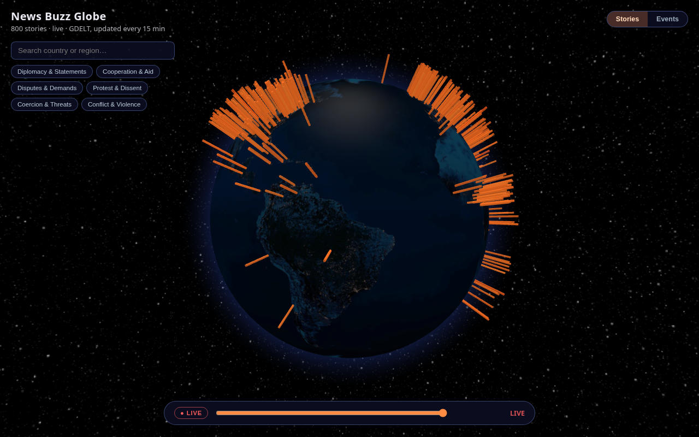
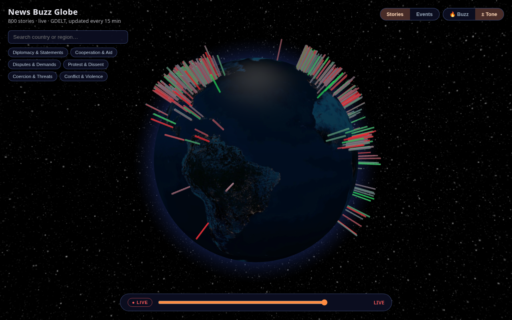
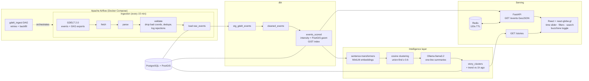

# News Buzz Globe 🌍

**Global news events, visualized as buzz-intensity hotspots on an interactive 3D globe — a full data-engineering + GenAI pipeline (GDELT → Airflow → PostGIS → dbt → embeddings → self-hosted LLM → FastAPI → React), built to run on $0/month infrastructure.**


| Stories view (LLM-labeled clusters) | Sentiment overlay (AvgTone) |
|---|---|
|  |  |

**Live link:** _pending deployment to the Oracle Cloud Always Free VM — see [docs/deployment.md](docs/deployment.md). The demo GIF above shows the app running against live GDELT data._

## What it does

Every 15 minutes the pipeline ingests the latest [GDELT 2.0](https://www.gdeltproject.org/) event export (~500–900 events with coordinates, article/source counts, tone, and CAMEO category codes), validates it, scores each event's **buzz intensity**:

```
intensity = 0.4·norm(NumArticles) + 0.3·norm(NumSources) + 0.3·recency_decay(event_time)
```

…then merges near-duplicate events about the same real-world story with local sentence-transformer embeddings and labels each cluster with a one-line headline generated by a **self-hosted Ollama LLM**. The React globe lets you rotate/zoom, click hotspots for details, scrub 48 hours of history with a time slider, filter by CAMEO theme, search countries with camera fly-to, and toggle between buzz-intensity and sentiment coloring — with rising/fading trend indicators per story.

## Architecture



## Quick start (local dev)

```bash
# 1. Database + cache (Postgres/PostGIS + Redis)
docker compose -f infra/docker-compose.yml up -d

# 2. Python env
python3 -m venv .venv && .venv/bin/pip install -e ".[dev]"

# 3. Lint + tests (101 pytest tests; needs the DB from step 1)
.venv/bin/ruff check . && .venv/bin/pytest

# 4. One ingestion cycle + dbt transform + story clustering
.venv/bin/python -m ingestion.pipeline
.venv/bin/dbt build --project-dir dbt --profiles-dir dbt/profiles
.venv/bin/python -m intelligence.job        # needs Ollama running locally

# 5. Backend API (http://localhost:8000/docs)
.venv/bin/uvicorn backend.app.main:app --port 8000

# 6. Frontend (http://localhost:5173)
cd frontend && npm install && npm run dev

# 7. Orchestration via Airflow (http://localhost:8080, admin/admin)
docker compose -f infra/docker-compose.yml --profile airflow up -d
```

Scheduling: the `gdelt_ingest` Airflow DAG (fetch → parse → validate → load → dbt transform) runs every 15 minutes with retries and true backfill — each data interval maps deterministically to GDELT's timestamped export files ([docs/airflow.md](docs/airflow.md)). A plain-cron fallback lives in `infra/cron/`.

## Repo layout

| Directory | Purpose |
|---|---|
| `ingestion/` | GDELT fetch → parse → validate → load pipeline |
| `dbt/` | Transform layer: staging → cleaned → scored models + 19 data tests |
| `intelligence/` | Embedding clustering + Ollama summarization + trend |
| `backend/` | FastAPI GeoJSON API (events, stories, themes, metrics) |
| `frontend/` | React + react-globe.gl app |
| `infra/` | Docker Compose (Postgres/PostGIS, Redis, Airflow), cron |
| `tests/` | 101 pytest tests (unit + API via TestClient) |
| `common/` | Shared models, DB helpers, structured logging |

## Notable engineering decisions

- **GDELT alone, deliberately.** It already aggregates tens of thousands of outlets with 15-minute updates, coordinates, and per-event volume counts. A second source (NewsAPI, Reddit, …) would add cross-schema deduplication complexity for no proportional benefit — the value here is the pipeline and visualization, not source count.
- **No Kafka, no Spark.** The data pattern is a scheduled batch pull of a few thousand rows every 15 minutes — well within single-machine pandas. Airflow provides the retries/backfill/observability that actually matter at this cadence. Streaming infrastructure would be résumé-driven complexity.
- **Similarity ≠ generation.** Story deduplication is a math problem: local MiniLM embeddings + cosine threshold + union-find. The generative LLM (self-hosted Ollama, llama3.2-3B on CPU) is reserved for the one job that warrants it — writing readable one-line headlines for clusters — and the pipeline degrades gracefully to member titles if Ollama is down.
- **$0/month hosting.** Everything runs on one Oracle Cloud Always Free VM (4 OCPU/24 GB Ampere) via Docker Compose: Postgres+PostGIS, Redis, FastAPI, Ollama, and the built frontend. CPU inference latency is a non-issue for ~25 summaries per 15-minute cycle. Fallback: Render (API) + Vercel/Netlify (frontend) + Neon (Postgres).
- **Two-layer data quality.** Ingestion validates operationally (drop garbage coordinates, dedupe event IDs, per-reason rejection accounting in structured logs + a persisted `ingestion_runs` metrics table), and dbt re-expresses the same rules declaratively with 19 schema/data tests — so quality is both enforced at the gate and continuously verified in the warehouse.

## Known limitations

- **GDELT bias.** Coverage skews toward Western/English-language media; CAMEO event coding is imperfect and translation/NLP artifacts appear in non-English titles. Buzz intensity therefore measures *media attention as GDELT sees it*, not ground truth importance.
- **CAMEO taxonomy ≠ consumer news topics.** CAMEO is a political-event taxonomy — there is no "sports" or "tech" category. The theme filter groups its 20 root codes into six honest political themes instead of pretending otherwise.
- **Single-source tradeoff.** If GDELT hiccups (it occasionally does), the globe shows stale data until the next successful cycle; retries + idempotent backfill mitigate but can't eliminate this.
- **Free-hosting constraints.** The always-free VM has finite headroom (embedding + LLM jobs are CPU-bound); Oracle signup requires a credit card and region capacity can be fickle. The fallback stack introduces cold starts (~30–60s on Render's free tier).
- **Story clusters are computed for "now".** The time slider replays raw events historically, but clustered/labeled stories exist only for the latest run (by design — clustering 48h of history each cycle would waste the free tier's CPU budget).

## Testing

- **pytest (101 tests):** intensity scoring, GDELT parsing incl. malformed rows, validation rules, clustering (union-find), summarization prompt/fallback, trend computation, cache-key coverage, and full API behavior via FastAPI `TestClient` against a disposable PostGIS database.
- **dbt (19 data tests):** unique/not-null on event IDs, accepted values on CAMEO root codes and QuadClass, intensity ∈ [0, 1].
- **CI:** GitHub Actions runs ruff + pytest (with a PostGIS service container) and the frontend build on every push.

## GenAI features

### RAG pipeline: "chat with the news"

Every clustering cycle (`intelligence/job.py`, every 15 minutes) writes deduplicated `story_clusters` rows as usual, then hands the same clusters to `intelligence/rag.py`:

1. **Indexing** — for each cluster, the representative member's page title + the cluster's LLM-generated headline are embedded with the *same* sentence-transformers model (`all-MiniLM-L6-v2`, cached once per process via `intelligence.cluster.get_model()`) already used for story deduplication — no second model load. The vectors are upserted into a local **Chroma** collection (`news_articles`), keyed by a stable hash of the cluster's member event IDs, so an ongoing story reappearing in a later run updates its entry instead of duplicating it. Chroma persists to `CHROMA_PATH` (default `./data/chroma`) on disk. Indexing failures are logged and swallowed — they never break the clustering job.
2. **Retrieval** — a query is embedded with the same model and matched against the Chroma collection by cosine similarity, returning the top-k most relevant stories with their metadata (title, summary, source URL, date).
3. **Generation** — the retrieved stories are assembled into a grounding prompt and sent to the same self-hosted **Ollama** (`llama3.2`) used for headline generation, instructed to answer only from that context. If Chroma or Ollama is unavailable, the pipeline degrades gracefully (`{answer: None, sources: [], error: "..."}`) rather than raising.

### `/chat` endpoint

```
POST /chat                {query} -> {answer, sources: [{title, source_url, date_added}], cached}
```

- **Caching:** answers are cached in Redis for 300s, keyed by a SHA-256 hash of the query (same pattern as the `/events` cache).

### Architecture

```
Airflow / cron (every 15 min)
        │
        ▼
intelligence/job.py  ──cluster + summarize──▶  story_clusters (Postgres)
        │
        ▼
intelligence/rag.py
   ├─ index_articles()  ──embed (MiniLM)──▶  Chroma (news_articles, ./data/chroma)
   ├─ retrieve(query)   ◀─cosine search────┘
   └─ answer(query)     ──grounded prompt──▶  Ollama (llama3.2)  ──▶  {answer, sources}
        ▲
        │  POST /chat  (Redis cache)
        │
   FastAPI (backend/app/main.py)
```

